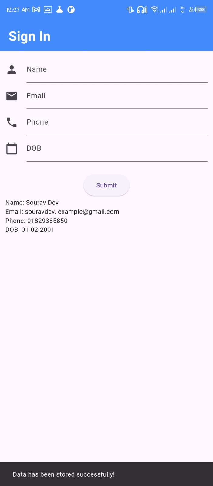
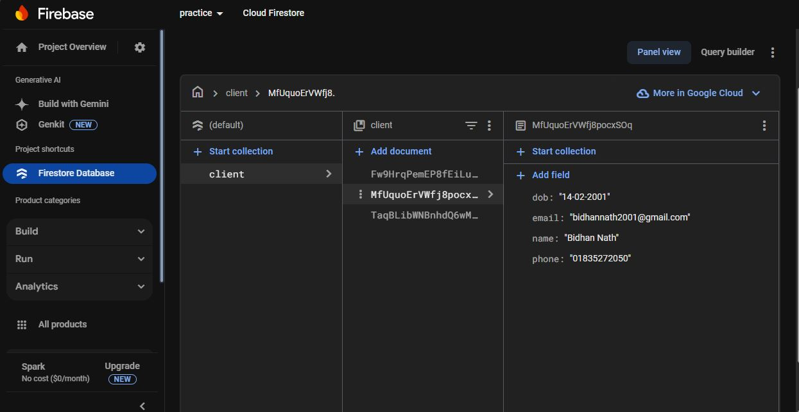
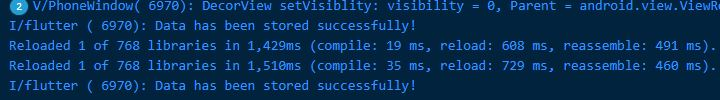

# Firebase Form Data Storage
This project demonstrates how to store data from form fields into Firebase.
## Getting Started
## Flutter Installation Guide
## Step 1: Download and Install Node.js/npm
```markdown
- Install [Node.js](https://nodejs.org/), which includes npm (Node Package Manager).
- To verify, run the following command in your terminal:
  node -v
  ```

## Step 2: Download and Install Git Bash
- Download and install [Git Bash](https://git-scm.com/) for Windows.

## Step 3: Open Firebase Console
- Go to the [Firebase Console](https://console.firebase.google.com/).
  
## Step 4: Create Account and Project
- Sign in to your Firebase account or create a new one.
- Create a new project and give it a name.

## Step 5: Click on Flutter Icon
- In the Firebase Console, click on the Flutter icon to integrate Firebase with your Flutter project.

## Step 6: Click on Firebase CLI and Open It
- Click on Firebase CLI and then click on the "Windows" button to download the CLI.

## Step 7: Scroll and Click on npm
- Scroll down and click on the npm option for Firebase CLI installation.

## Step 8: Run the Command to Install Firebase CLI
- Open any directory or command prompt (CMD) and run the following command:
  ```bash
  npm install -g firebase-tools
  ```

## Step 9: Log in to Firebase CLI
- In your terminal, run the following command to log in to Firebase:
  ```bash
  firebase login
  ```
- Complete the login process.

## Step 10: Install FlutterFire CLI
- Run the following command to install the FlutterFire CLI:
  ```bash
  dart pub global activate flutterfire_cli
  ```

## Step 11: Configure Firebase for Your Project
- In your project’s root directory, run:
  ```bash
  flutterfire configure --project=our-new-application
  ```

## Step 12: Select Platform or Press Enter
- Select the platform you’re working on or just press Enter to configure for all platforms.

## Step 13: Enter the Application ID
- Open your Android project and navigate to `android/app/build.gradle`.
- Copy the application ID and paste it into the terminal when prompted.

## Step 14: Add the Path to Environment Variables
- Copy the path provided in the terminal and add it to your system’s environment variables.

---

## For Testing the Connection (main.dart)

Add the following code in your `main.dart` file to initialize Firebase:

```dart
void main() async {
  WidgetsFlutterBinding.ensureInitialized();
  await Firebase.initializeApp(
    options: DefaultFirebaseOptions.currentPlatform,
  );
  runApp(MyApp());
}
```
To add data into firebase
```dart
  CollectionReference store =
      FirebaseFirestore.instance.collection('client');
  store.add({
    'name': name.text,
    'email': email.text,
    'phone': phone.text,
    'dob': dob.text,
  });
```
---

## Required Packages

Add the following dependencies to your `pubspec.yaml` file:

```yaml
dependencies:
  firebase_core: latest_version
  cloud_firestore: latest_version
```
Click the **Get Package** icon in the top-right corner of the `pubspec.yaml` file to download and install the packages.
# Output

|  | <br><br><br> |
|:----------------------:|:-------------------------------------------:|


